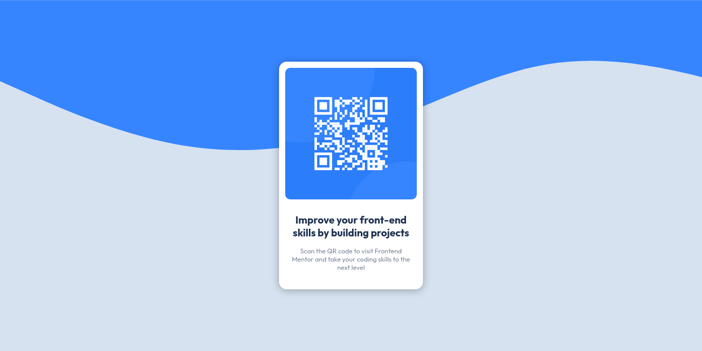

# **Frontend Mentor - QR code component solution**

This is a solution to the [QR code component challenge on Frontend Mentor](https://www.frontendmentor.io/challenges/qr-code-component-iux_sIO_H).

 

## **Preview**

 

## **Links**

- Solution URL: [click here](https://www.frontendmentor.io/solutions/qr-code-component-but-slightly-tweaked-with-creativity-sG0vtRwcp5)
- Live Site URL: [click here](https://0xabdulkhalid.github.io/qr-code-component/)
 

## **Built With**

-    
-    

 

## **Tools Used**

-    
-   
-   
- 

 

## **Outcome**

* Used HTML5 **semantic elements** for better readability and structure
* Used CSS3's **flex** property to manage layout
* Used **Git** and **GitHub** for project management
* Tried to maintain **clean code**
* Used **media queries** for responsive design
* **Cross tested** on Firefox and Chromium based browsers

 

## **What I learned**

* Learned to set CSS **custom properties**
* Learned to use **Flexbox** effectively
* Practiced **Mobile-first** workflow
* A lot of minor things

 

<!-- ACKNOWLEDGMENTS -->
## **Acknowledgment**

* Inspiration by [Frontend Mentor](https://www.frontendmentor.io)

 

## **Author**

- Website - [0xabdulkhalid](https://www.0xabdulkhalid.ml)
- Frontend Mentor - [@0xabdulkhalid](https://www.frontendmentor.io/profile/0xabdulkhalid)
- Twitter - [@0xabdulkhalid](https://www.twitter.com/0xabdulkhalid)
- LinkedIn - [0xabdulkhalid](https://www.linkedin.com/in/0xabdulkhalid)
